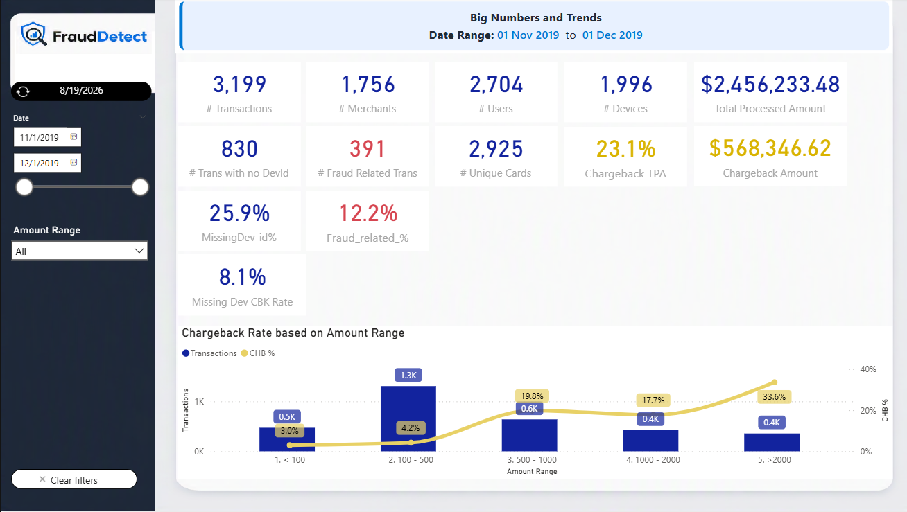
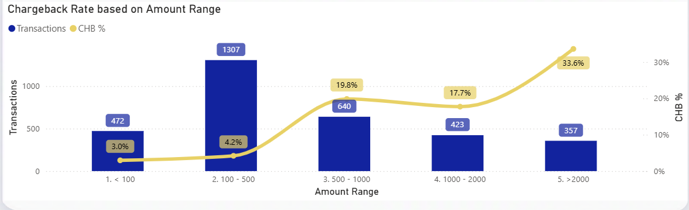
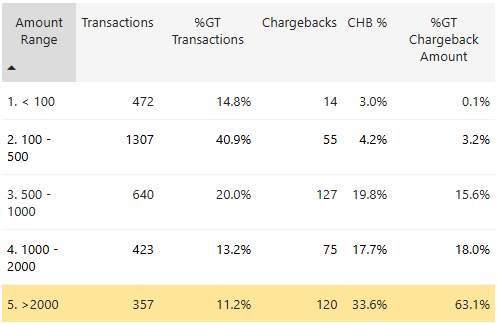
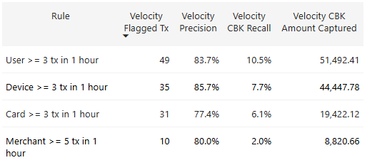
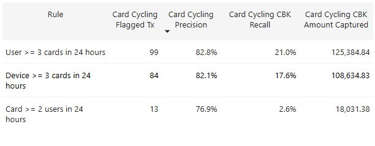
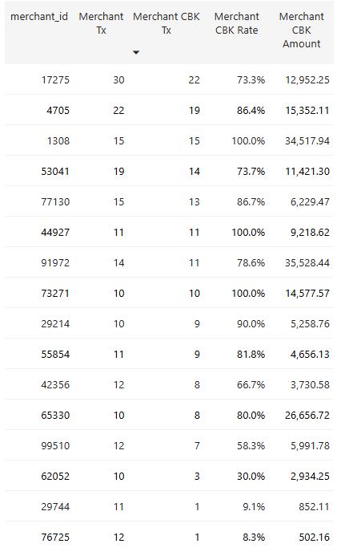
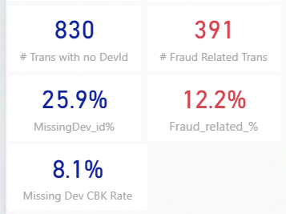
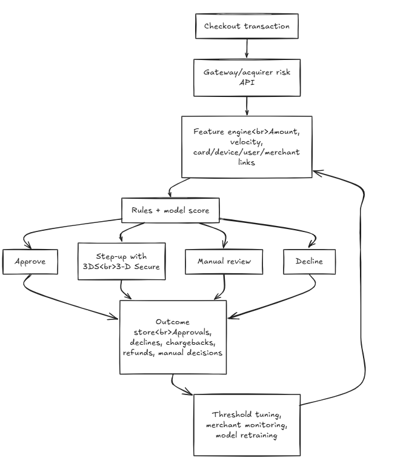

# Data Analyst Case: North Star and Initial Analysis

Source files used:

- [casecsv.csv](casecsv.csv)
- [Data_Analyst_I_Case_External.pdf](Data_Analyst_I_Case_External.pdf)
- [case.pbix](case.pbix)
All files presented on Github :

## North Star

The core objective should be to reduce fraud-related chargeback losses while preserving legitimate approved volume.

For this case, the best north-star metric is:

**Fraud chargeback value rate = fraud-related chargeback amount / total processed amount**

Baseline from the dataset:
These metrics can be found in the PBI Project Page "Big Numbers"

- Total transactions: 3,199
- Total processed amount: 2,456,233.48
- Fraud-related chargeback transactions: 391
- Transaction chargeback rate: 12.2%
- Chargeback amount: 568,346.62
- Chargeback value rate: 23.1%

This should be paired with guardrail metrics so the anti-fraud strategy does not simply block too much good business:

- Approval rate for legitimate customers
- False-positive rate or manual-review rate
- Chargeback count rate
- Chargeback amount captured by rules/model
- Merchant experience impact
- Time to decision at checkout

An initial practical target could be: prioritize rules that capture the largest chargeback value with a manageable review queue. In this data, a simple rule set based on high amount or velocity flags 14.0% of transactions while catching 72.9% of chargeback value.

## Industry Context

### 1. Money Flow, Information Flow, and Main Players

In a card-not-present transaction, the main players are:

| Player | Role |
|---|---|
| Cardholder | Buyer who uses the card. |
| Merchant | Seller accepting the payment. |
| Payment gateway | Technical layer that captures and routes payment data. |
| Acquirer | Financial institution/processor that enables the merchant to accept cards, sends authorization requests, settles funds, and carries merchant risk. |
| Card network | Visa, Mastercard, Elo, etc. Routes messages and enforces scheme rules. |
| Issuer | Cardholder's bank. Approves or declines the transaction and later bills the cardholder. |

Information flow:

1. Cardholder enters payment data at merchant checkout.
2. Merchant or gateway sends the transaction request to the acquirer.
3. Acquirer routes the authorization request through the card network.
4. Network sends it to the issuer.
5. Issuer approves or declines based on funds, card status, authentication, and risk.
6. The response flows back through the same chain to the merchant.

Money flow:

1. After authorization, the transaction is captured/settled.
2. Issuer transfers funds through the network to the acquirer.
3. Acquirer pays the merchant, net of fees, reserves, and adjustments.
4. If a chargeback occurs later, the money can be reversed from merchant/acquirer back to issuer/cardholder.

### 2. Acquirer vs Sub-Acquirer vs Payment Gateway

| Type | What it does | Risk exposure | How the flow changes |
|---|---|---|---|
| Acquirer | Holds the acquiring relationship, connects merchants to card networks, settles funds, manages disputes, and carries merchant risk. | High. It is exposed to fraud, chargebacks, and merchant default. | Merchant connects directly or through a processor/gateway to the acquirer. Settlement is between acquirer and merchant. |
| Sub-acquirer/payment facilitator | Onboards many sub-merchants under a broader acquiring setup. Often provides easier onboarding, aggregation, risk tools, and merchant management. | Medium to high. It manages sub-merchant risk and may be liable to the sponsor acquirer. | The sub-merchant connects to the sub-acquirer, which connects to the acquirer. Funds and risk controls pass through an extra intermediary. |
| Payment gateway | Technical service that securely captures, tokenizes, and routes payment data. | Usually lower. It does not normally own settlement or merchant credit risk. | Gateway sits in the information flow, not the main money flow. The acquirer still handles authorization connectivity, settlement, and disputes. |

### 3. Chargebacks, Cancellations, and Fraud

A chargeback is a formal card dispute initiated by the cardholder or issuer after a transaction has been authorized and usually settled. In this dataset, `has_cbk` specifically indicates a fraud-related chargeback.

A cancellation/refund is merchant-initiated. It can happen when the merchant voids a transaction before settlement or refunds the customer after settlement. A cancellation is usually part of normal customer service or order management.

Key differences:

| Topic | Chargeback | Cancellation/refund |
|---|---|---|
| Initiated by | Cardholder/issuer | Merchant/customer service process |
| Timing | Usually after settlement | Before settlement as void, or after settlement as refund |
| Network dispute process | Yes | Usually no |
| Fraud signal | Strong, especially with fraud reason codes | Not necessarily fraud |
| Cost/risk | Fees, lost revenue, monitoring exposure, possible acquirer liability | Usually controlled merchant reversal |

In acquiring, fraud matters because the acquirer or sub-acquirer can be financially exposed if the merchant cannot cover chargebacks. High chargeback ratios can also trigger card-network monitoring programs, reserves, delayed settlements, or merchant termination.

### 4. What Anti-Fraud Is and How an Acquirer Uses It

Anti-fraud is the set of data, rules, models, processes, and operational controls used to detect or prevent fraudulent transactions before losses become chargebacks.

An acquirer uses anti-fraud to:

- Score transactions before or during authorization.
- Apply step-up authentication such as 3DS(3-D Secure) when risk is high.
- Decline or manually review risky transactions.
- Monitor merchants with abnormal chargeback behavior.
- Create velocity limits for users, devices, cards, and merchants.
- Hold settlements, create reserves, or offboard merchants with unacceptable risk.
- Feed confirmed chargeback outcomes back into rules and models.

## Initial Data Analysis

### Dataset Profile (Big Numbers)
These metrics can be found in the PBI Project Page "Big Numbers"

| Metric | Value |
|---|---:|
| Transactions | 3,199 |
| Date range | 2019-11-01 to 2019-12-01 |
| Unique merchants | 1,756 |
| Unique users/cardholders | 2,704 |
| Unique masked cards | 2,925 |
| Unique non-missing devices | 1,996 |
| Missing device IDs | 830 transactions, 25.9% |
| Fraud-related chargebacks | 391 transactions, 12.2% |
| Total processed amount | 2,456,233.48 |
| Chargeback amount | 568,346.62, 23.1% of processed amount |

The data is highly sparse by entity: many merchants/users/cards appear only a few times. Because of that, the strongest initial approach is not a complex model. It is feature engineering around transaction amount, velocity, entity links, and merchant concentration.

### Suspicious Behavior 1: High-Ticket Transactions(Fraud Evidences Page Left-down Table)

Chargeback rate rises sharply with transaction amount.

| Amount band | Transactions | Chargebacks | Chargeback rate |
|---|---:|---:|---:|
| <100 | 472 | 14 | 3.0% |
| 100-500 | 1,307 | 55 | 4.2% |
| 500-1,000 | 640 | 127 | 19.8% |
| 1,000-2,000 | 423 | 75 | 17.7% |
| >=2,000 | 357 | 120 | 33.6% |

Same Visual was Plotted in "Fraud Scenarios" page

What led to this conclusion:

- Transactions above 2,000 are only 11.2% of volume but represent 63.1% of chargeback value.
- The 2,000+ amount band has a 33.6% chargeback rate, far above the 12.2% overall baseline.

Action:

- High-ticket CNP(Card-not-Present) transactions should not necessarily be auto-declined, but they should trigger stronger controls such as manual review, device/IP checks, or stricter merchant-level thresholds.

### Suspicious Behavior 2: Velocity Bursts

Several users, cards, devices, and merchants show many transactions in short windows, often ending in chargebacks.

Deployable rolling-rule performance:

| Rule | Flagged tx | Precision | Chargeback tx recall | Chargeback amount captured |
|---|---:|---:|---:|---:|
| User >= 3 tx in 1 hour | 49 | 83.7% | 10.5% | 9.1% |
| Card >= 3 tx in 1 hour | 31 | 77.4% | 6.1% | 3.4% |
| Device >= 3 tx in 1 hour | 35 | 85.7% | 7.7% | 7.8% |
| Merchant >= 5 tx in 1 hour | 10 | 80.0% | 2.0% | 1.6% |

Same Visual was Plotted in "Fraud Scenarios" page 

What led to this conclusion:

- Velocity rules have low coverage but very high precision.
- This pattern is consistent with card testing, stolen-card usage, or scripted abuse.

Action:

- Add velocity limits at user, card, device, and merchant levels.
- Treat high-velocity + high-amount transactions as review or step-up candidates.
- Use rolling windows such as 5 minutes, 1 hour, and 24 hours.

### Suspicious Behavior 3: Card Cycling by the Same User or Device

Some users/devices use many different cards in a short period. This is a strong CNP(Card-not-Present) fraud signal.

| Rule | Flagged tx | Precision | Chargeback tx recall | Chargeback amount captured |
|---|---:|---:|---:|---:|
| User >= 3 cards in 24 hours | 99 | 82.8% | 21.0% | 22.1% |
| Device >= 3 cards in 24 hours | 84 | 82.1% | 17.6% | 19.1% |
| Card >= 2 users in 24 hours | 13 | 76.9% | 2.6% | 3.2% |

Same Visual was Plotted in "Fraud Scenarios" page 

What led to this conclusion:

- Legitimate users rarely use many different cards in a short period.
- Legitimate devices rarely process many unrelated cards unless they are a merchant POS, which this is not because all transactions are card-not-present.

Action:

- Limit the number of distinct cards per user/device per day.
- Flag mismatches where one card appears under multiple users.
- Combine this with IP, email, phone, billing address, and device fingerprint data.

### Suspicious Behavior 4: Concentrated Risk in Certain Merchants

Some merchants have extreme chargeback rates and large chargeback amounts.

| Merchant ID | Tx | Chargebacks | Chargeback rate | Chargeback amount |
|---|---:|---:|---:|---:|
| 17275 | 30 | 22 | 73.3% | 12,952.25 |
| 4705 | 22 | 19 | 86.4% | 15,352.11 |
| 1308 | 15 | 15 | 100.0% | 34,517.94 |
| 53041 | 19 | 14 | 73.7% | 11,421.30 |
| 77130 | 15 | 13 | 86.7% | 6,229.47 |
| 44927 | 11 | 11 | 100.0% | 9,218.62 |
| 91972 | 14 | 11 | 78.6% | 35,528.44 |
| 73271 | 10 | 10 | 100.0% | 14,577.57 |

Same Visual was Plotted in "Fraud Scenarios" page 

What led to this conclusion:

- These merchants have much higher chargeback rates than the 12.2% baseline.
- Some show suspicious combinations of many cards, few users/devices, and repeated high-value transactions.

Action:

- Place these merchants under enhanced monitoring.
- Review onboarding/KYC, business model, fulfillment proof, and refund behavior.
- Consider rolling reserves, delayed settlement, lower limits, or termination depending on investigation results.

### Suspicious Behavior 5: Missing Device ID Is Not Enough Alone
Infos Plotted in "Big Numbers" page 

Missing device ID appears in 25.9% of transactions, but its chargeback rate is 8.1%, below the overall 12.2% baseline.

What led to this conclusion:

- Device-present transactions had a 13.7% chargeback rate.
- Missing-device transactions had a lower 8.1% chargeback rate.

Action:

- Do not use missing device ID as a standalone decline rule.
- Instead, treat it as a data-quality issue and combine it with amount, velocity, merchant risk, IP,3DS(3-D Secure) and authentication data.

## Initial Rule Strategy

A single rule is not enough. A tiered strategy performs better:

| Strategy | Flagged tx | Precision | Chargeback tx recall | Chargeback amount captured |
|---|---:|---:|---:|---:|
| Amount >= 2,000 | 357, 11.2% | 33.6% | 30.7% | 63.1% |
| High amount or velocity | 448, 14.0% | 42.6% | 48.8% | 72.9% |
| Tiered review candidate | 125, 3.9% | 71.2% | 22.8% | 34.1% |

Suggested interpretation:

- Use `amount >= 2,000` as a value-protection signal, not an automatic decline rule.
- Use velocity/card-cycling rules as stronger fraud indicators because their precision is above 80% in this dataset.
- Use a tiered decision engine:
  - Low risk: approve.
  - Medium risk: 3DS(3-D Secure)(3-D Secure) or friction step-up.
  - High risk: manual review or decline.
  - Merchant risk: settlement hold, reserve, or enhanced monitoring.

## Additional Data to Request

To broaden the analysis beyond the spreadsheet, request data in these categories:

| Data type | Why it matters |
|---|---|
| IP address and geolocation | Detect impossible travel, proxy/VPN use, country mismatch. |
| Device fingerprint details | Detect repeated devices even when `device_id` is missing or manipulated. |
| Email, phone, account age | Identify disposable identities and newly created risky users. |
| Billing and shipping address | Compare distance, mismatch, repeated addresses, reshipping patterns. |
| BIN/issuer/card country | Identify risky issuers, prepaid cards, foreign card mismatch. |
| Authorization response, CVV, AVS | Understand issuer-side risk and authentication quality. |
| 3DS(3-D Secure) data | Separate authenticated and unauthenticated CNP(Card-not-Present) traffic. |
| Product/SKU/category | Fraud often clusters in high-resale-value goods. |
| Merchant category, onboarding/KYC | Detect risky business models or bad merchants. |
| Refund/cancellation data | Distinguish merchant service issues from fraud disputes. |
| Chargeback reason code and dispute date | Measure fraud lag and root cause. |
| Delivery/fulfillment proof | Useful for dispute representment and merchant quality review. |
| Historical merchant/user/card behavior | Needed for stable risk scoring over time. |

## Recommendations

Immediate measures:

- Add velocity rules for user, card, device, and merchant activity.
- Add card-cycling rules for users/devices using multiple cards in 24 hours.
- Apply step-up authentication or manual review to high-ticket CNP(Card-not-Present) transactions.
- Create a merchant watchlist for merchants with high chargeback rates and high chargeback value.
- Do not decline solely because `device_id` is missing; improve data capture instead.

Operational measures:

- Investigate the highest-risk merchants before expanding limits.
- Use rolling reserves or delayed settlement for merchants with abnormal fraud ratios.
- Build case-management queues for high-risk transactions and merchants.
- Track false positives so rules do not damage legitimate conversion.
- Create a feedback loop from confirmed chargebacks into the anti-fraud logic.

Strategic measures:

- Move from static rules to a risk-score decision engine.
- Add supervised ML once more features and a longer historical window are available.
- Use network intelligence, issuer response data, 3DS(3-D Secure) outcomes, device intelligence, and behavioral data.
- Separate transaction-level fraud risk from merchant-level risk.

## Proposed Anti-Fraud Solution

A practical solution for an acquirer would have five layers:

1. Data ingestion

   Collect real-time transaction data, merchant data, card/user/device histories, issuer responses, chargeback outcomes, and external risk signals.

2. Feature engine

   Compute real-time features such as amount percentile, transaction velocity, distinct cards per user/device, merchant chargeback rate, IP distance, device reputation, and 3DS(3-D Secure) outcome.

3. Risk decision engine

   Combine rules and a model score. Return one of four decisions: approve, step-up authentication, manual review, or decline.

4. Merchant monitoring

   Score merchants separately using chargeback rate, chargeback amount, refund behavior, dispute lag, onboarding/KYC risk, and transaction concentration.

5. Feedback loop

   Feed chargebacks, cancellations, manual-review outcomes, and confirmed fraud labels back into the system to tune thresholds and retrain models.

Initial conceptual architecture:

## Steps Taken

1. Read the PDF case brief to confirm the expected deliverables: suspicious behavior identification, broader data needs, recommendations, anti-fraud design, and payment-industry explanation.
2. Loaded the CSV and validated the available columns: `transaction_id`, `merchant_id`, `user_id`, `card_number`, `transaction_date`, `transaction_amount`, `device_id`, and `has_cbk`.
3. Converted dates, amounts, chargeback labels, and missing device flags into analyzable fields.
4. Built baseline metrics for transaction count, date range, unique entities, missing values, chargeback rate, and chargeback amount.
5. Compared chargeback behavior by amount bands.
6. Grouped transactions by merchant, user, card, and device to find concentrated risk.
7. Created rolling time-window features to simulate what could be known at authorization time.
8. Tested simple fraud-control rules and measured flagged volume, precision, chargeback recall, and chargeback amount captured.
9. Translated the strongest findings into actions, recommendations, and an anti-fraud solution design.
10. Loaded ALL insights in a [PBI Dashboard](case.pbix) with All Measures and refinement needed to get to this Result.
11.  Most of the Calculations are using Measures ( Measures Table) . Few calculated columns were required to get to the Result and make All visuals responsive with the Filters Available ( Date Range and Amount Range)
    
